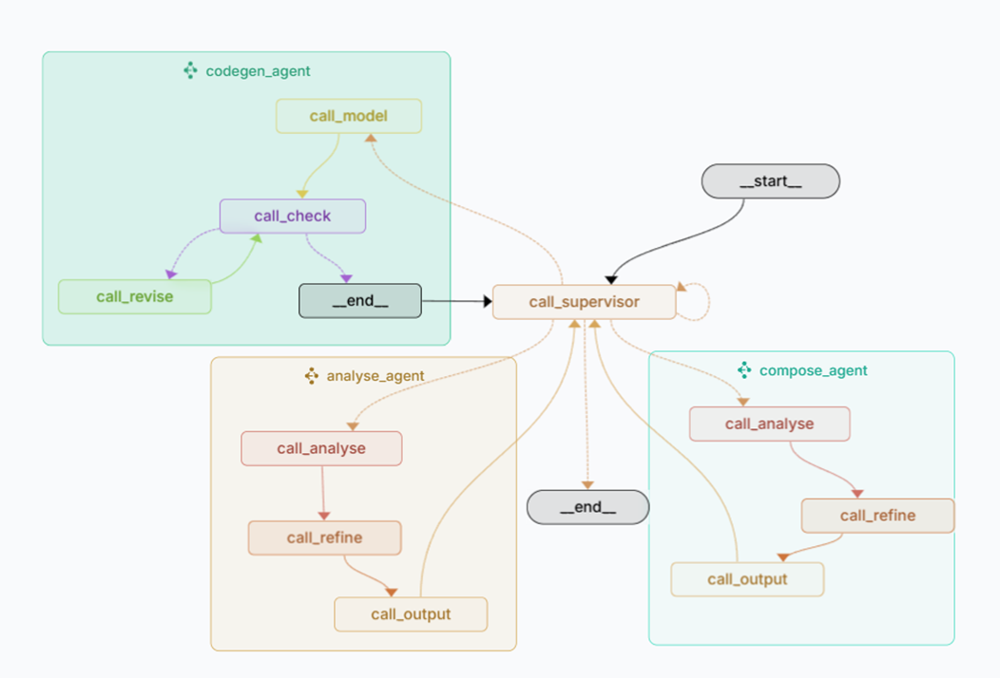

# MCP 代码生成代理系统

基于 LangGraph 框架构建的多代理协作系统，用于自动化生成符合 Model Context Protocol (MCP) 规范的 TypeScript 代码。该系统能够将自然语言需求转换为完整的 MCP 服务实现。



## 功能特点

- 自然语言需求分析与转换
- 自动生成符合 MCP 规范的 TypeScript 代码
- 支持数据库和浏览器操作类型的 MCP 服务生成
- 自动生成配套的项目文件（package.json、tsconfig.json、README.md）
- 基于多代理协作的工作流程，确保代码质量

## 系统架构

系统采用基于图的状态管理方式，由四个主要代理组成：

1. **主控代理 (Supervisor)** - 协调整个工作流程
2. **需求分析代理 (Analysis Agent)** - 分析用户需求并转换为结构化格式
3. **代码生成代理 (Generate Agent)** - 生成并验证 MCP 服务代码
4. **代码整合代理 (Compose Agent)** - 生成配套的项目文件

工作流程：用户需求 → 需求分析 → 代码生成 → 代码整合 → 完整 MCP 服务

## 安装指南

### 前提条件

- Python 3.8+
- pip 包管理器

### 安装步骤

1. 安装 LangGraph CLI：

```bash
pip install --upgrade "langgraph-cli[inmem]"
```

2. 克隆本仓库：

```bash
git clone <repository-url>
cd mcp_codegen_agent
```

3. 安装项目依赖：

```bash
pip install -e .
```

4. 创建 `.env` 文件并配置必要的 API 密钥：

```
ANTHROPIC_API_KEY=your_anthropic_api_key
OPENAI_API_KEY=your_openai_api_key
DEEPSEEK_API_KEY=your_deepseek_api_key
```

## 使用方法

1. 启动 LangGraph Studio 服务器：

```bash
python run.py
```

2. 在浏览器中访问 LangGraph Studio 界面（通常为 http://localhost:3000）

3. 输入自然语言需求，系统将自动生成符合 MCP 规范的代码

4. 生成的代码和配置文件将保存在 `result` 目录中

## 代理说明

### 主控代理 (Supervisor)

- 负责控制代码生成流程
- 根据用户输入判断是否进入下一步
- 维护对话记忆和状态管理

### 需求分析代理 (Analysis Agent)

- 利用 ReAct 机制分析用户需求
- 将需求分解为可执行的步骤
- 输出结构化的 JSON 格式需求

### 代码生成代理 (Generate Agent)

- 根据分析结果生成 MCP 服务代码
- 包含代码生成与代码审查功能
- 通过审查-修订循环调整代码质量
- 支持数据库和浏览器操作类型的代码生成

### 代码整合代理 (Compose Agent)

- 生成 package.json 配置文件
- 生成 tsconfig.json 配置文件
- 生成项目 README.md 文档

## 限制说明

- 当前版本不支持 Retrieval Tool
- 代码生成主要针对数据库和浏览器操作类型的 MCP 服务

## 许可证

[MIT License](LICENSE)
